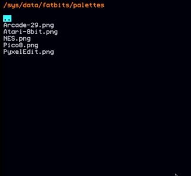
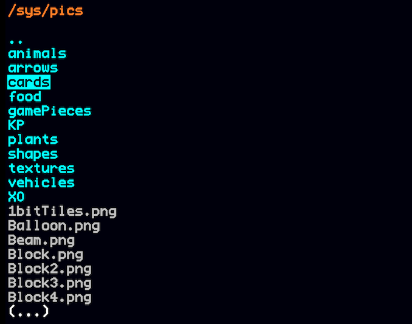

# File Navigator

A simple file-navigator tool for the Mini Micro



## Features:

* Navigate directories
* **Load MiniScript files**
* Preview images
* Preview sounds
* Preview text files

# Installation

This tool can be used as a stand-alone program, but it really shines when imported as a module on system startup. That way it is always "present" and can be invoked  without replacing a loaded program.

In order to do so the file `filenav.ms` has to be put somewhere where it can be imported as a module. Preferably under 

```
/usr/lib
```

Then, your `startup.ms` needs to include something like:

```
import "filenav"

// Create a function alias
// Change `fn` to whatever suits you
fn = function()
  filenav.Nav.run
end function

// Save this state to survive "reset"s
_saveGlobals
```

This would create a function `fn` (short for **f**ile **n**avigator) which would invoke the file-navigator in the current working directory.

You can of course choose another name.

The last line `_saveGlobals` is particularly important, otherwise this function would be deleted if you execute a `reset` statement.

# Usage

When invoking the file-navigator you will see a list of file-entries in the current working directory:



Directories will be placed first, and then files. Both sorted alphabetically.

Navigate the list with the arrow keys. Navigate into a directory be pressing ENTER; even the parent `..` directory.

You can "preview" files by pressing SPACE on them (except miniscript files, see below). This uses the Mini Micro `view` utility under the hood. Common media types like images will be displayed, sounds will be played.

One notable exception are miniscript files. Upon pressing SPACE on a miniscript file it will be **loaded** and the execution of the file-navigator immediately ended. After that you can choose to edit or run the loaded file.

In order to "view" miniscript files, press the letter V instead.
